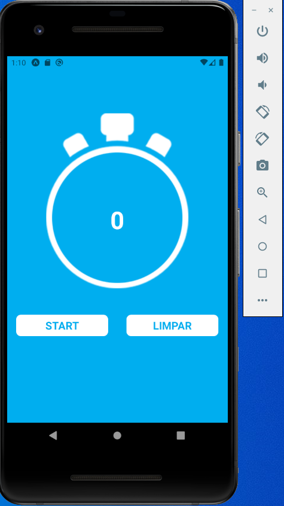
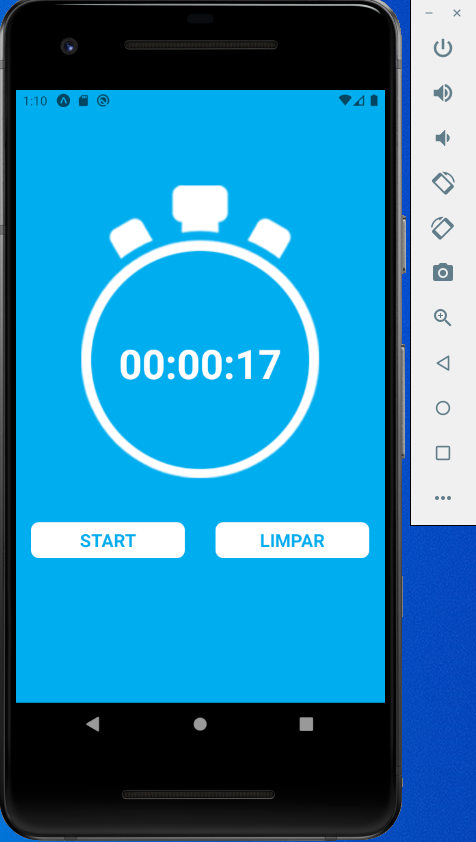

<div align="center">
  <h1>App Cronometro</h1>
</div>

<div align="center">
  
  
  
</div>

Cronometro com REACT NATIVE

## ✔️ Técnicas e tecnologias utilizadas

Lista de tecnologias que foram usadas nesse projeto:


## 🛠️ Abrir e rodar o projeto

Para abrir e rodar o projeto, entre na pasta do projeto e execute ```npm install``` para instalar as dependências e ```npm start``` para iniciar o projeto.

## 📚 Mais informações

Entre em contato pelo [linkedin](https://www.linkedin.com/in/grazziano-fagundes/).

<div align="center">
  <small>Grazziano Borges Fagundes - 2023</small>
</div>
